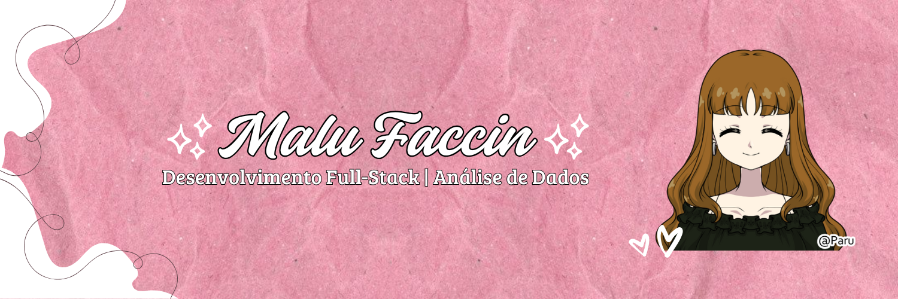

   

- 💻 Sou apaixonada por tecnologia, mídias digitais e programação.

- 🎓 Atualmente, estou cursando Análise e Desenvolvimento de Sistemas na UVV.

- 🌱  Além de programar, estudo Data Science e Business Intelligence.

 

## 

<a href="https://github.com/malufaccin/SweetShop">
  <picture>
    
  </picture>
</a>

<a href="https://github.com/malufaccin/BiblioTech">
  <picture>
    
  </picture>
</a>

<a href="https://github.com/malufaccin/MyBookVibes">
  <picture>
    
  </picture>
</a>

 
  <a href="https://github.com/malufaccin?tab=repositories">
    <picture>
      
    </picture>
  </a>

  
  
  
  
  
  
  
  
  
  
  
  
  
  
  

##  Sobre meu Github  

 
  

  

## Minhas redes sociais:

  
 

  

